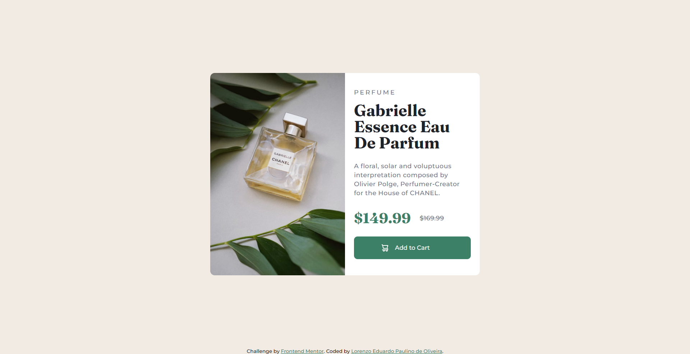
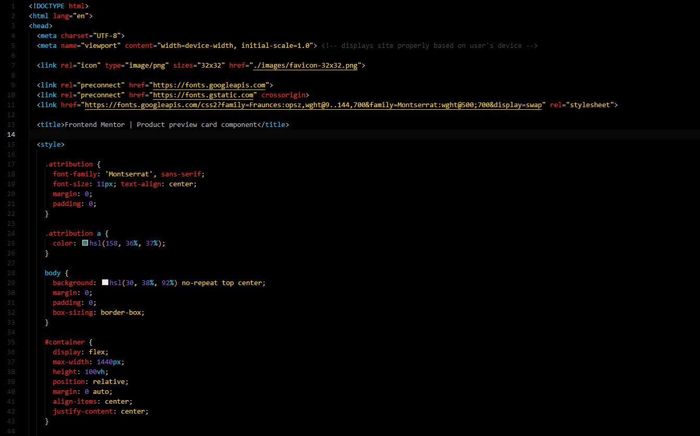
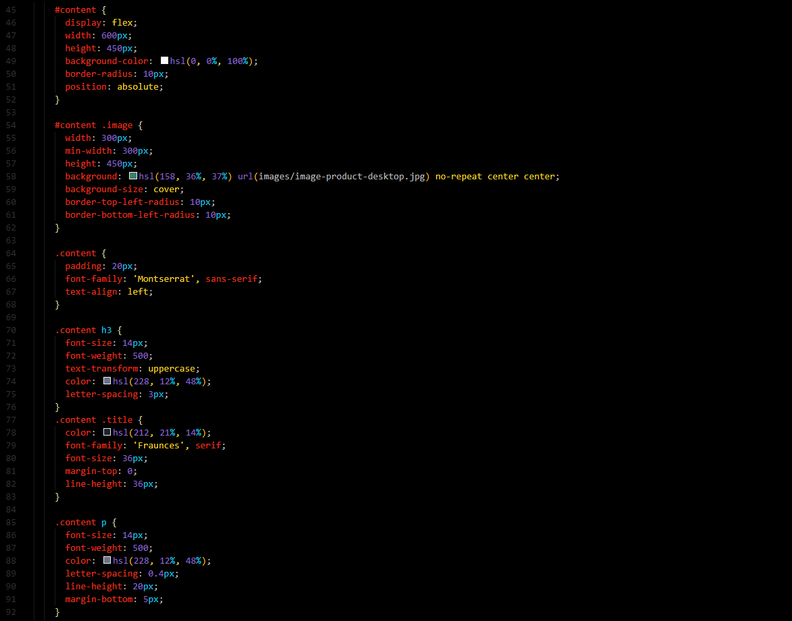
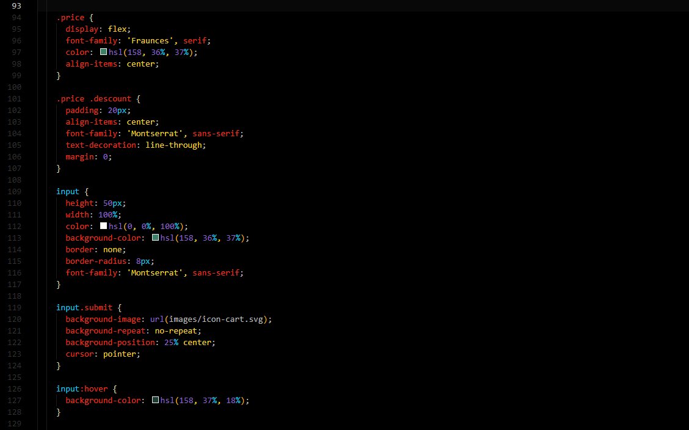
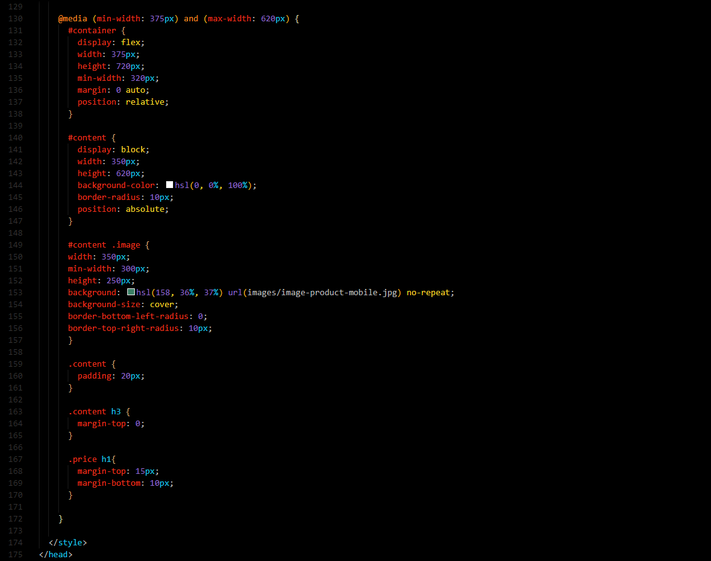
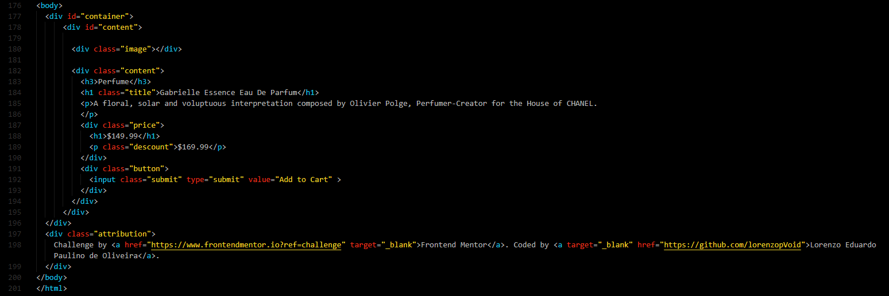

# Frontend Mentor - Product preview card component solution

This is a solution to the [Product preview card component challenge on Frontend Mentor](https://www.frontendmentor.io/challenges/product-preview-card-component-GO7UmttRfa). Frontend Mentor challenges help you improve your coding skills by building realistic projects. 

## Table of contents

- [Overview](#overview)
  - [The challenge](#the-challenge)
  - [Screenshot](#screenshot)
  - [Links](#links)
- [My process](#my-process)
  - [Built with](#built-with)
  - [What I learned](#what-i-learned)
  - [Continued development](#continued-development)
  - [Useful resources](#useful-resources)
- [Author](#author)
- [Acknowledgments](#acknowledgments)

**Note: Delete this note and update the table of contents based on what sections you keep.**

## Overview

### The challenge

Users should be able to:

- View the optimal layout depending on their device's screen size
- See hover and focus states for interactive elements

### Screenshot













### Links

- Solution URL: [Finished project](https://lorenzopvoid.github.io/project-product-preview-card-component/)
- Live Site URL: [Netlify link project](project-product-preview-card-componen.netlify.app)

## My process

### Built with

- Semantic HTML5 markup
- CSS custom properties
- Media Query

### What I learned

First I created a <div> with id=container that would store all the information about the content of the product, then I created a new <div> where the content of the card would be allocated.
in this <div> in which I placed the id=content I separated the main elements that form the card, being the  that is to the left of the written content, the written content in order:
- the type of product;
- the title of the product;
- the composition of the product;
- product value;
- product discount;
- buy button.

I created a separate <div> to contain the price and discount of the product to make the content better distributed, and another <div> to format the "add to cart" button.

After creating all the semantic body of the product, I started to format the CSS.

Starting CSS formatting from top to bottom;

When I finished the first phase of the code I realized that it would be impossible to leave it as it was due to the image.

So I incremented the image in the CSS itself which made me very happy because from there I was also able to correctly format the image of the mobile version.

```css

#content .image {
      width: 300px;
      min-width: 300px;
      height: 450px;
      background: hsl(158, 36%, 37%) url(images/image-product-desktop.jpg) no-repeat center center;
      background-size: cover;
      border-top-left-radius: 10px;
      border-bottom-left-radius: 10px;
    }

```

In the mobile version I had to break the layout of the page content in block

```css
#content {
        display: block;
}
```
so that the items were one below the other, I also changed the image following the previous pattern by incrementing the css itself, changing only the display size.

I was also happy with the purchase button configuration because I believed that it would be very difficult to add an image to a button and after looking for the solution on some sites I got the following result:

```css
input {
       height: 50px;
       width: 100%;
       color: hsl(0.0%, 100%);
       background-color: hsl(158, 36%, 37%);
       border: none;
       border-radius: 8px;
       font-family: 'Montserrat', sans-serif;
     }
input.submit {
       background-image: url(images/icon-cart.svg);
       background-repeat: no-repeat;
       background-position: 25% center;
       cursor: pointer;
     }
input:hover {
       background-color: hsl(158, 37%, 18%);
     }
```

Primeiro eu criei uma <div> com id=container que guardaria todas as informaçoes sobre o conteudo do produto, em seguida eu criei uma nova <div> onde seria alocado o conteudo do cartao.
nessa <div> na qual coloquei o id=content eu separei os principais elementos que formam o cartao, sendo eles a  que fica a esquerda do conteudo escrito, o conteudo escrito em ordem: 
- o tipo do produto; 
- o titulo do produto; 
- a composiçao do produto;
- valor do produto;
- desconto do produto;
- botão de compra.

Criei uma <div> separada para conter o preço e desconto do produto para deixar o conteudo melhor distribuido, e outra <div> para formatar o botão de "adicionar ao carrinho".

Após criar todo o corpo semantico do produto, parti para a formataçao do CSS.

Começando a formataçao do CSS de cima para baixo;

Quando terminei a primeira fase do codigo percebi que seria impossivel deixa-lo como estava devido a imagem. 

Entao incrementei a imagem no proprio CSS isso me deixou muito feliz pois a partir dai tambem consegui formatar corretamente a imagem da versao mobile.

```css

#content .image {
      width: 300px;
      min-width: 300px;
      height: 450px;
      background: hsl(158, 36%, 37%) url(images/image-product-desktop.jpg) no-repeat center center;
      background-size: cover;
      border-top-left-radius: 10px;
      border-bottom-left-radius: 10px;
    }

```

Na versão mobile tive que quebrar o layout do conteudo da pagina em block

```css
#content {
        display: block;
}
```
para que os itens ficassem um abaixo do outro, tambem mudei a imagem seguido o padrao anterior incrementando no proprio css, mudando apenas o tamanho de exibição.

Também fiquei feliz com a configuração do botao de compra pois acreditava que seria muito dificil adicionar uma imagem em um botao e após buscar a solução em alguns sites consegui o seguinte resultado :

```css 
input {
      height: 50px;
      width: 100%;
      color: hsl(0, 0%, 100%);
      background-color: hsl(158, 36%, 37%);
      border: none;
      border-radius: 8px;
      font-family: 'Montserrat', sans-serif;
    }
input.submit {
      background-image: url(images/icon-cart.svg);
      background-repeat: no-repeat;
      background-position: 25% center;
      cursor: pointer;
    }
input:hover {
      background-color: hsl(158, 37%, 18%);
    }
```


### Continued development

I intend to learn how to assemble more organized sites with more difficult configurations, and study some more simple concepts that still confuse me sometimes, this will make my way of programming evolve, and of course not just stick to the basics like html and css, I hope to learn javascript soon

### Useful resources

- [Fonts Google](https://fonts.google.com/) 
- [Folhas de estilo CSS dicas e truques](https://www.w3.org/Style/Examples/007/center.pt_BR.html) - This is an amazing article which helped me finally understand how to center elements. I'd recommend it to anyone still learning this concept.

## Author

- Website - [Lorenzo Eduardo Paulino de Oliveira](https://github.com/lorenzopVoid)
- Frontend Mentor - [@lorenzopVoid](https://www.frontendmentor.io/profile/lorenzopVoid)


